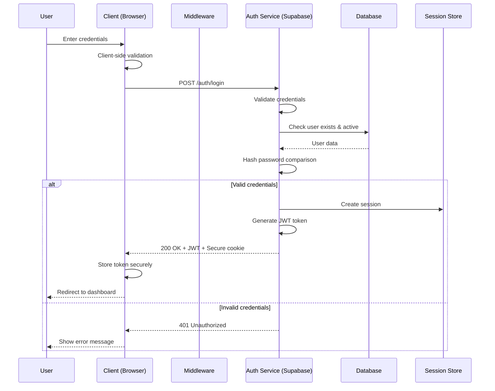
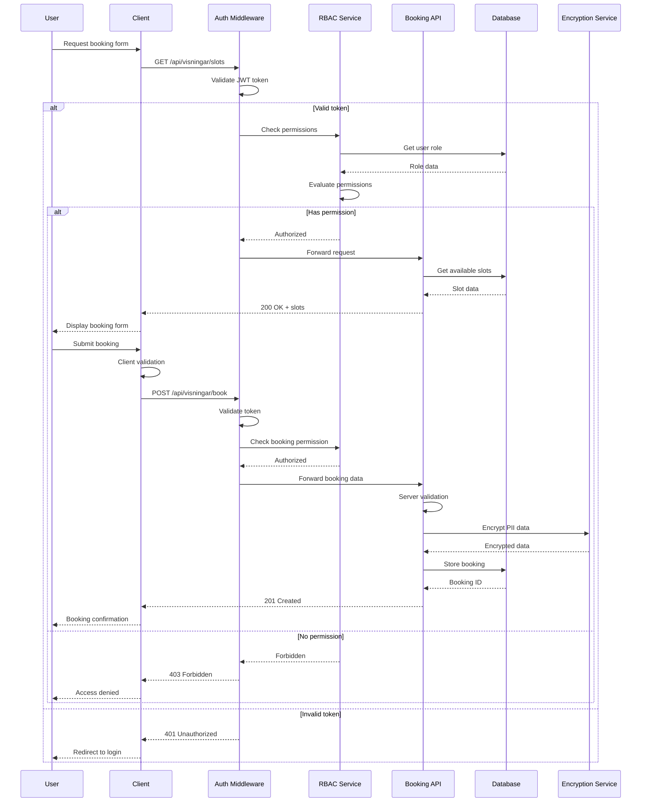
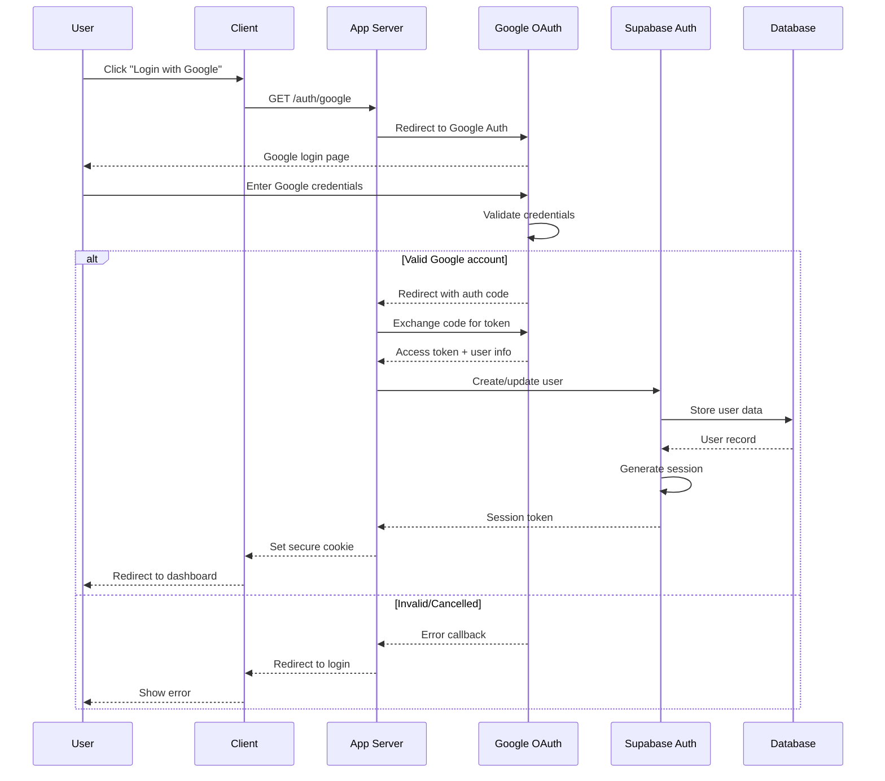
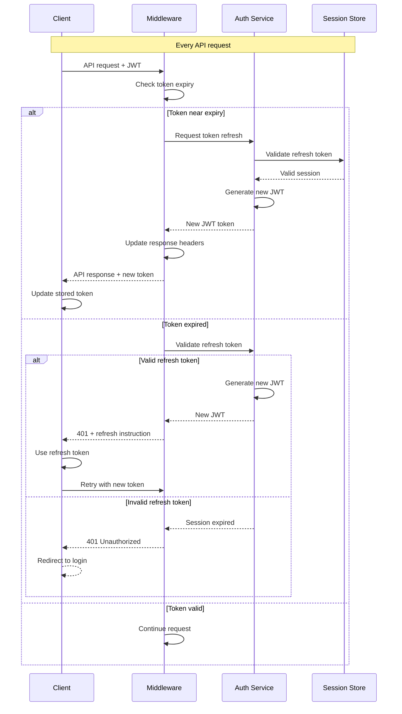
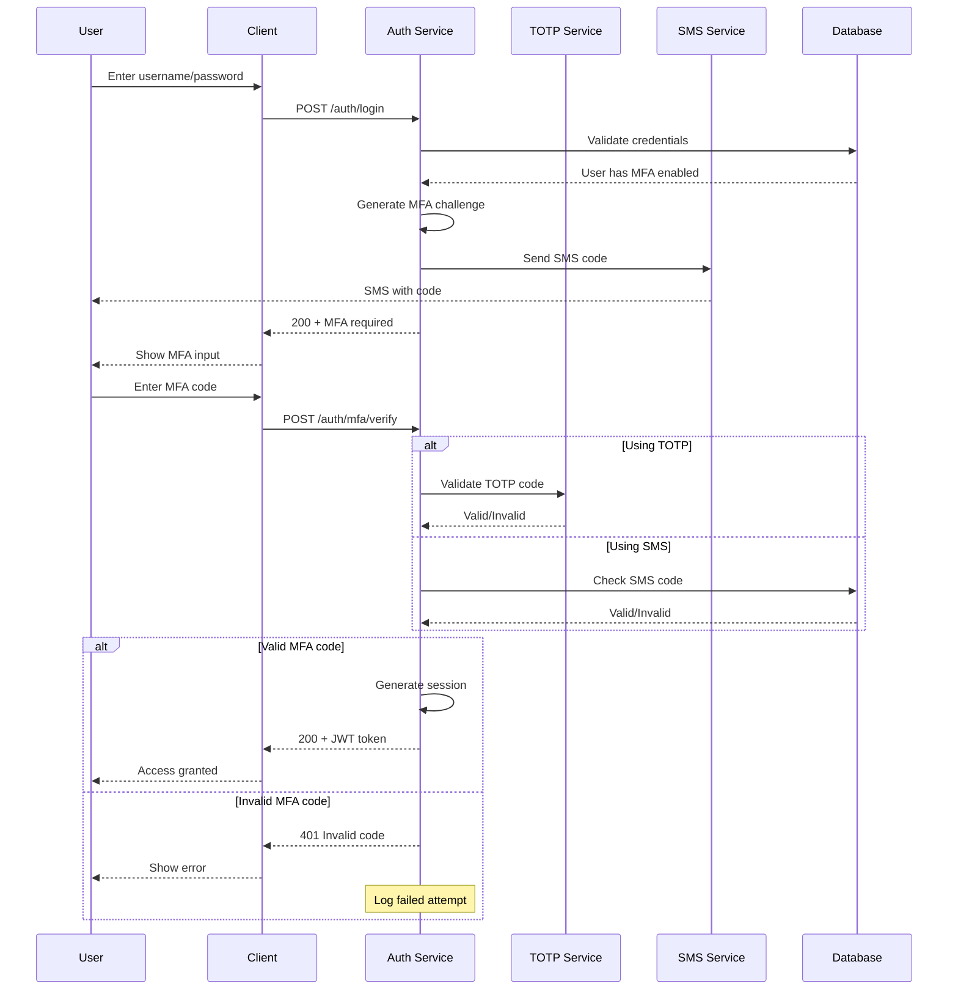
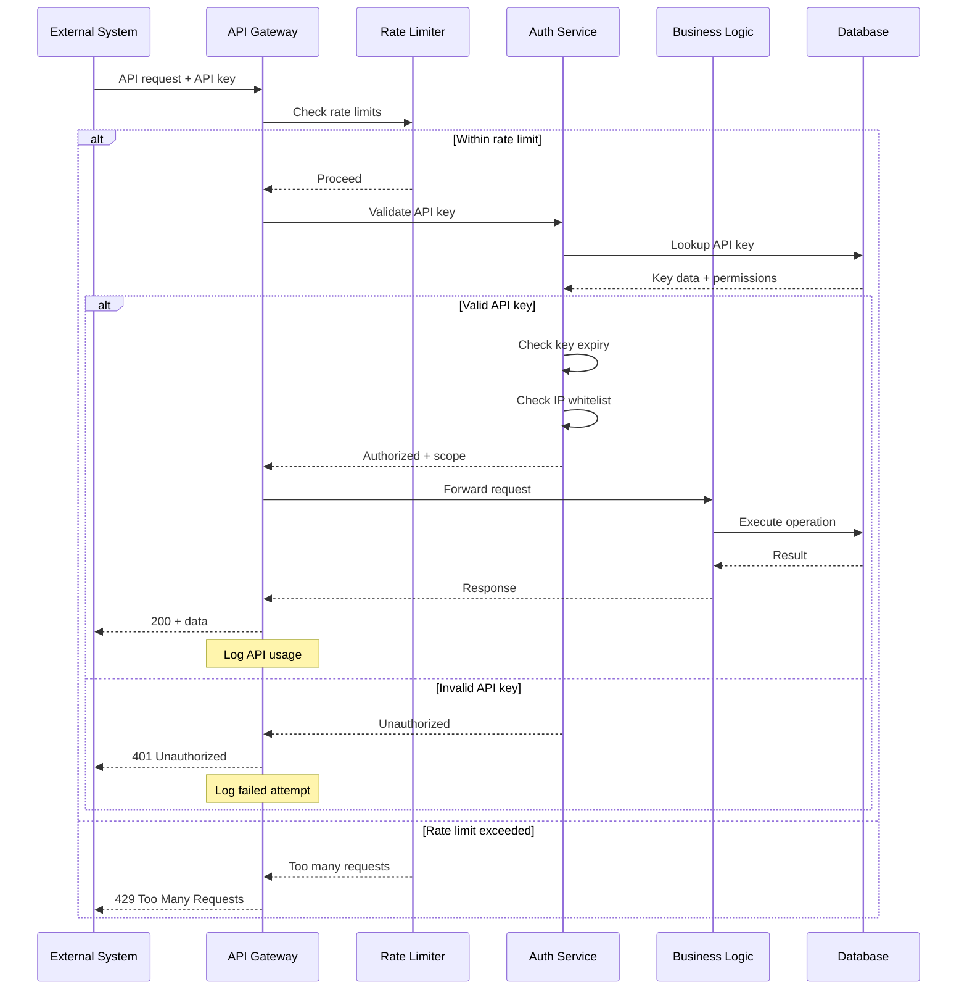
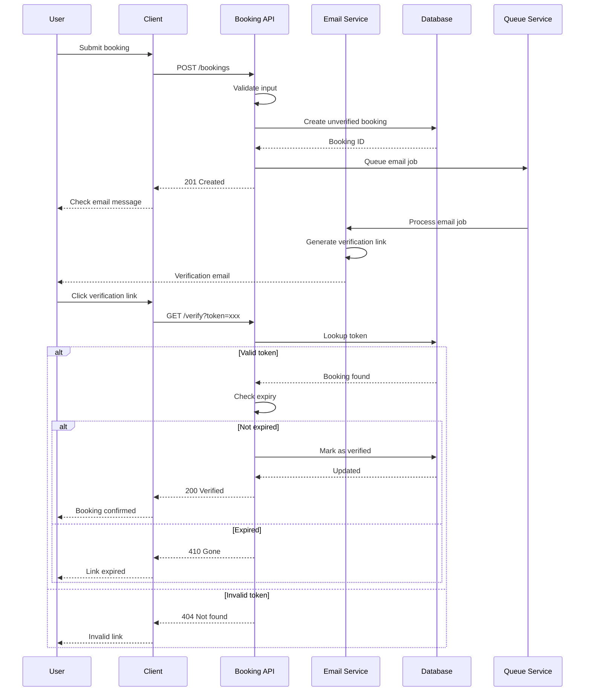
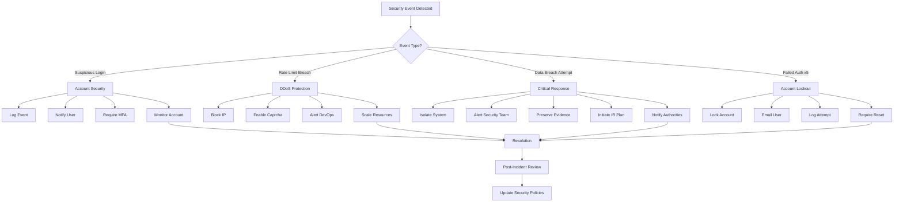
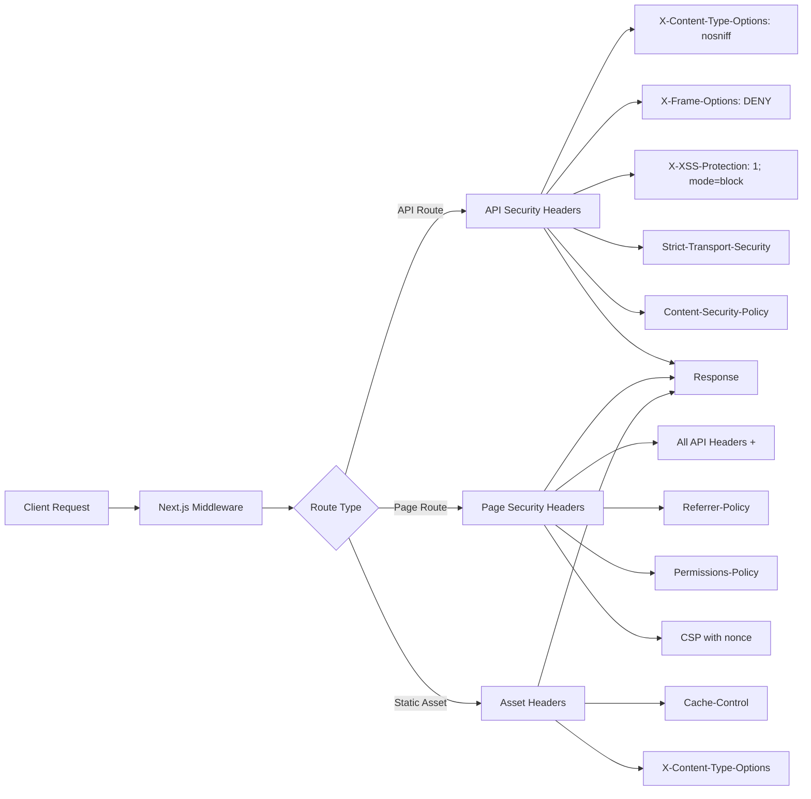

# Authentication & Authorization Flow Diagrams

## 1. User Authentication Flow



## 2. Visning Booking Authorization Flow



## 3. OAuth2 Flow (Google Login)



## 4. Session Refresh Flow



## 5. Multi-Factor Authentication Flow



## 6. API Key Authentication Flow (for integrations)



## 7. Booking Verification Flow



## 8. Security Incident Response Flow



## Security Headers Configuration



## Implementation Notes

### 1. Token Storage Best Practices
- **Access Token**: Store in memory (not localStorage)
- **Refresh Token**: HttpOnly, Secure, SameSite cookie
- **CSRF Token**: Session storage + header

### 2. Session Security
- Session timeout: 30 minutes of inactivity
- Absolute timeout: 8 hours
- Refresh token rotation on use
- Device fingerprinting for anomaly detection

### 3. Rate Limiting Tiers
```
Public endpoints:     100 req/15 min
Authenticated:        500 req/15 min  
Booking creation:     5 req/hour
Login attempts:       5 req/15 min
API key (basic):      1000 req/hour
API key (premium):    10000 req/hour
```

### 4. Audit Logging Requirements
Every authentication event must log:
- Timestamp (UTC)
- User ID (if available)
- IP address
- User agent
- Event type
- Success/failure
- Failure reason (if applicable)

### 5. GDPR Compliance in Auth
- Explicit consent for data processing
- Right to data portability
- Right to erasure (with audit trail)
- Data minimization in logs
- Encryption at rest for PII

### 6. Security Monitoring Alerts
Trigger alerts for:
- 5+ failed login attempts from same IP
- Successful login from new location
- Privilege escalation attempts
- API key usage from non-whitelisted IP
- Any critical security events